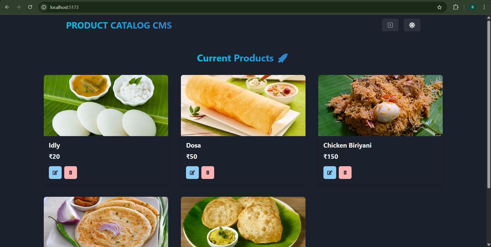
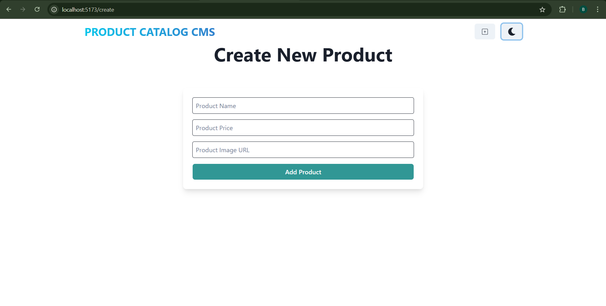

# 🗂️ Product Catalog CMS

A simple Product Catalog Content Management System built using the **MERN stack** (MongoDB, Express.js, React.js, Node.js). This application allows users to add, edit, and delete products, with a clean interface built using **Chakra UI**. Includes a dark/light mode toggle for better UX.

---

## 🚀 Features

- 📝 Add, edit, and delete products
- 🌓 Light/Dark mode toggle (with Chakra UI)
- ⚛️ Frontend in React with Chakra components
- 🌐 Backend API using Express and MongoDB
- 💾 Product data stored in MongoDB

---

## 🛠️ Tech Stack

**Frontend**:
- React.js
- Chakra UI
- React Router

**Backend**:
- Node.js
- Express.js
- MongoDB (via Mongoose)

---

## 🧑‍💻 Setup Instructions

1. **Clone the repository**
   git clone https://github.com/your-username/product-catalog-cms.git
   cd product-catalog-cms

2. **Install dependencies**
   cd client && npm install
   cd ../server && npm install

3. **Environment variables**
   MONGO_URI=your_mongodb_connection_string
   PORT=5000

4. **Run the app**
 
    **Start backend**
         npm run dev
        
    **Start frontend**
         cd frontend;
         npm run dev

---

## 📸 Screenshots

---

## 📄 License

This project is licensed under the MIT License - see the [LICENSE](LICENSE) file for details.

---

## 🙌 Author
    Made with ❤️ by BALAMURALI-404
    📧 bbalamurali2004@gmail.com